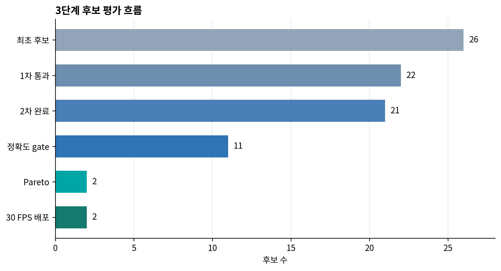
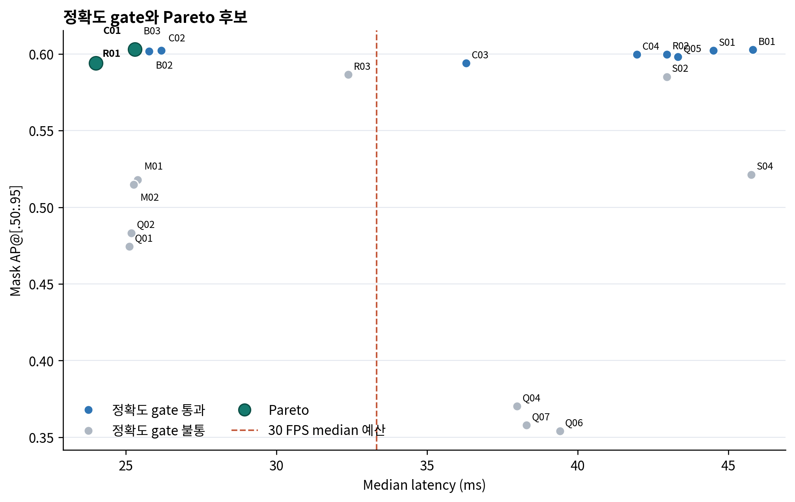
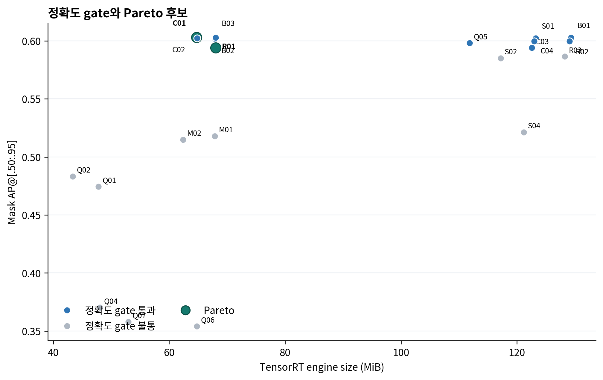
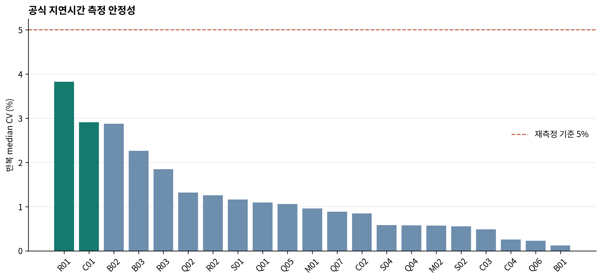

# Stage 3 최종 분석 및 논문 작성 입력

> 이 문서는 논문 결과 장을 작성하기 전에 수치, 판정, 추천 원칙과 근거를
> 하나의 공식 실행으로 고정한다. 모든 표와 그림은 machine-readable 결과에서 자동 생성한다.

## 공식 결과 동결

- 공식 성능 실행 ID: `20260904_104755`
- 장비: NVIDIA GeForce RTX 4050 Laptop GPU, CUDA 12.8, TensorRT 10.16.1.11
- 조건: AC 전원, platform profile 및 CPU EPP `performance`
- 후보 흐름: 1차 26개 → 2차 대상 22개 → 완료 21개 → 정확도 gate 통과 11개 → Pareto 2개
- Q03: INT4 block quantization parser 오류로 engine build 실패
- 지연시간: 고정 32장, warm-up 20회, 200회 × 3반복; 총 63개 반복 모두 부하 gate 통과
- CV 5% 초과 후보와 재측정 후보: 0개
- 최대 반복 median CV: R01 3.82%
- 데이터셋 의미적 fingerprint와 이미지 collection fingerprint: 노트북·데스크톱 일치
- 최종 Pareto engine C01·R01: 노트북 보존 파일의 SHA-256 일치

## 평가 흐름

| 단계 | 후보 수 | 판정 |
|---|---:|---|
| 최초 후보 | 26 | registry 전체 |
| 1차 정적 통과 | 22 | 2차 대상 |
| 2차 완료 | 21 | 정확도·성능 실측 확보 |
| 2차 실패 | 1 | Q03 engine build 실패 |
| 정확도 gate 통과 | 11 | B01, B02, B03, S01, C01, C02, C03, C04, R01, R02, Q05 |
| Pareto 비지배해 | 2 | C01, R01 |
| 최종 30 FPS 배포 후보 | 2 | C01, R01 |

## 최종 판정표

| ID | 경량화 방식 | 1차 | 2차 | 정확도 gate | 30 FPS | P95 경고 | Pareto | 최종 사유 |
|---|---|---|---|---|---|---|---|---|
| B01 | none | 통과 | 완료 | 통과 | 불통 | 경고 | 아니오 | 정확도 gate 통과 후 C01에 지배됨 |
| B02 | tensorrt-fp16 | 통과 | 완료 | 통과 | 통과 | — | 아니오 | 정확도 gate 통과 후 C01에 지배됨 |
| B03 | tensorrt-int8-ptq | 통과 | 완료 | 통과 | 통과 | — | 아니오 | 정확도 gate 통과 후 C01에 지배됨 |
| U01 | global-magnitude; sparsity=0.1 | 불통 | 대상 외 | — | — | — | 아니오 | ONNX 크기·node·dense MACs 중 어느 항목도 사전 고정 5% 감소 기준을 충족하지 못함 |
| U02 | global-magnitude; sparsity=0.3 | 불통 | 대상 외 | — | — | — | 아니오 | ONNX 크기·node·dense MACs 중 어느 항목도 사전 고정 5% 감소 기준을 충족하지 못함 |
| U03 | global-magnitude; sparsity=0.5 | 불통 | 대상 외 | — | — | — | 아니오 | ONNX 크기·node·dense MACs 중 어느 항목도 사전 고정 5% 감소 기준을 충족하지 못함 |
| M01 | nvidia-2to4; pattern=2:4 | 통과 | 완료 | 불통 | 통과 | — | 아니오 | BBox AP Δ -0.1033 < -0.0100; Mask AP Δ -0.0847 < -0.0100; mIoU Δ -0.0294 < -0.0200 |
| M02 | nvidia-2to4; pattern=2:4 | 통과 | 완료 | 불통 | 통과 | — | 아니오 | BBox AP Δ -0.1055 < -0.0100; Mask AP Δ -0.0878 < -0.0100; mIoU Δ -0.0369 < -0.0200 |
| S01 | decoder-layer; remove_layers=1 | 통과 | 완료 | 통과 | 불통 | 경고 | 아니오 | 정확도 gate 통과 후 C01에 지배됨 |
| S02 | decoder-layer; remove_layers=2 | 통과 | 완료 | 불통 | 불통 | 경고 | 아니오 | BBox AP Δ -0.0217 < -0.0100; Mask AP Δ -0.0176 < -0.0100 |
| S03 | ffn-dimension; reduction=0.2 | 불통 | 대상 외 | — | — | — | 아니오 | ONNX 크기·node·dense MACs 중 어느 항목도 사전 고정 5% 감소 기준을 충족하지 못함 |
| S04 | ffn-dimension; reduction=0.4 | 통과 | 완료 | 불통 | 불통 | 경고 | 아니오 | BBox AP Δ -0.2198 < -0.0100; Mask AP Δ -0.0813 < -0.0100; mIoU Δ -0.0644 < -0.0200 |
| C01 | structured-selected | 통과 | 완료 | 통과 | 통과 | — | 예 | 최종 Pareto 비지배해 |
| C02 | structured-selected | 통과 | 완료 | 통과 | 통과 | — | 아니오 | 정확도 gate 통과 후 C01에 지배됨 |
| C03 | structured-resolution; input=432x432 | 통과 | 완료 | 통과 | 불통 | 경고 | 아니오 | 정확도 gate 통과 후 C01, R01에 지배됨 |
| C04 | structured-resolution; input=480x480 | 통과 | 완료 | 통과 | 불통 | 경고 | 아니오 | 정확도 gate 통과 후 C01에 지배됨 |
| R01 | input-resolution; input=432x432 | 통과 | 완료 | 통과 | 통과 | — | 예 | 최종 Pareto 비지배해 |
| R02 | input-resolution; input=480x480 | 통과 | 완료 | 통과 | 불통 | 경고 | 아니오 | 정확도 gate 통과 후 C01에 지배됨 |
| R03 | input-resolution; input=384x384 | 통과 | 완료 | 불통 | 통과 | 경고 | 아니오 | BBox AP Δ -0.0114 < -0.0100; Mask AP Δ -0.0161 < -0.0100 |
| Q01 | modelopt-int8-smoothquant; INT8_SMOOTHQUANT_CFG | 통과 | 완료 | 불통 | 통과 | — | 아니오 | BBox AP Δ -0.1447 < -0.0100; Mask AP Δ -0.1283 < -0.0100; mIoU Δ -0.0529 < -0.0200 |
| Q02 | modelopt-mixed-precision; INT8_DEFAULT_CFG | 통과 | 완료 | 불통 | 통과 | — | 아니오 | BBox AP Δ -0.1414 < -0.0100; Mask AP Δ -0.1194 < -0.0100; mIoU Δ -0.0616 < -0.0200 |
| Q03 | modelopt-int4-weight-only; INT4_BLOCKWISE_WEIGHT_ONLY_CFG | 통과 | 엔진 생성 실패 | — | — | — | 아니오 | TensorRT 10.16.1.11 INT4 DequantizeLinear parser 오류 (상세 로그: results/stage2-notebook-logs/Q03-build.log) |
| Q04 | modelopt-fp8; FP8_DEFAULT_CFG | 통과 | 완료 | 불통 | 불통 | 경고 | 아니오 | BBox AP Δ -0.7343 < -0.0100; Mask AP Δ -0.2324 < -0.0100; mIoU Δ -0.2589 < -0.0200 |
| Q05 | modelopt-fp8-mixed; FP8_DEFAULT_CFG | 통과 | 완료 | 통과 | 불통 | 경고 | 아니오 | 정확도 gate 통과 후 C01에 지배됨 |
| Q06 | modelopt-fp8-mixed-kld; FP8_DEFAULT_CFG | 통과 | 완료 | 불통 | 불통 | 경고 | 아니오 | BBox AP Δ -0.7338 < -0.0100; Mask AP Δ -0.2486 < -0.0100; mIoU Δ -0.2554 < -0.0200 |
| Q07 | modelopt-fp8-mixed; FP8_DEFAULT_CFG | 통과 | 완료 | 불통 | 불통 | 경고 | 아니오 | BBox AP Δ -0.7097 < -0.0100; Mask AP Δ -0.2447 < -0.0100; mIoU Δ -0.2831 < -0.0200 |

## Pareto 결과

주 목적은 Mask AP 최대화, median latency 최소화, engine size 최소화다.
BBox AP, semantic mIoU, P95 latency와 GPU memory는 해석용 보조지표다.
정확도 gate를 통과한 후보 중 C01과 R01만 비지배해이며, 나머지는 두 후보 중
하나에 세 주 목적 모두에서 지배된다.

| 후보 | Mask AP | Median(ms) | P95(ms) | Engine(MiB) | B01 대비 latency | B01 대비 engine |
|---|---:|---:|---:|---:|---:|---:|
| B01 | 0.6026 | 45.820 | 48.562 | 129.3 | 기준 | 기준 |
| C01 | 0.6029 | 25.300 | 27.512 | 64.7 | 44.79% 감소 | 49.95% 감소 |
| R01 | 0.5941 | 24.010 | 25.821 | 68.1 | 47.60% 감소 | 47.38% 감소 |

C01은 R01보다 median latency가 1.289 ms 느리지만 Mask AP가 0.00880 높고 engine은 3.3 MiB 작다.

## 최종 추천 원칙

단일 가중합 점수로 임의의 절대 우승자를 만들지 않고 배포 목적별로 추천한다.

| 시나리오 | 추천 | 근거 |
|---|---|---|
| 균형형 | C01 | B01 수준 Mask AP, 더 높은 mIoU, 44.79% latency 감소, 49.95% engine 감소 |
| 정확도 우선 | C01 | 정확도 gate 통과 후보 중 최고 Mask AP |
| 크기 우선 | C01 | Pareto 후보 중 더 작은 64.7 MiB engine |
| 속도 우선 | R01 | 정확도 gate 통과 후보 중 최저 median 24.010 ms |

B03은 정확도 gate 통과 후보 중 최고 BBox AP, C02는 같은 집합에서 최고 semantic mIoU를 기록한 보조 비교 후보로 보고하되,
세 주 목적에서는 C01에 지배되므로 최종 Pareto 추천에는 포함하지 않는다.

## 측정 안정성과 실시간 해석

- P95 33.33 ms 초과 경고 후보: B01, S01, S02, S04, C03, C04, R02, R03, Q04, Q05, Q06, Q07
- P95 경고는 진단 지표이며 정확도 gate, Pareto 또는 배포 후보의 hard gate가 아니다.
- 30 FPS 판정은 median latency ≤ 33.33 ms이며 지속 처리량 또는 모든 프레임의 30 FPS를 보장하지 않는다.
- 반복 median CV는 모두 5% 이하여서 공식 재측정 라운드는 발생하지 않았다.

## 논문에서 허용되는 주장과 제한

- 허용: 기록된 RTX 4050 Laptop GPU 성능 우선 조건에서 C01·R01이 3축 Pareto 비지배해였다.
- 허용: C01과 R01 모두 median 기준 30 FPS 예산을 충족했다.
- 제한: 437장은 반복 비교용 benchmark이므로 완전히 손대지 않은 confirmatory test로 표현하지 않는다.
- 제한: 외부 장소·카메라·날씨에 대한 일반화, 실제 ROS2 end-to-end latency와 주차 성공률은 검증하지 않았다.
- 제한: Q03의 실패는 현재 TensorRT parser와 export 형식의 호환성 실패이며 INT4 전체의 일반적 실패로 확대하지 않는다.
- 제한: 단일 학습 seed와 단일 GPU 결과이므로 학습·장비 간 분산을 추정하지 않는다.

## 논문 작성 전에 남은 비실험 작업

1. 본 문서의 수치와 근거 연결표를 이용해 개조식 구성안과 줄글 초안을 Stage 3로 갱신한다.
2. 참고문헌의 저자·학회·페이지·DOI를 제출 양식에 맞게 검증한다.
3. 저장소에 근거가 없는 데이터 수집 조건, 라벨링 기준, 기존 ASK 논문 정보와 사사 문구는 사용자 자료를 받아 채운다.
4. 부하 수준별 스트레스 실험, 외부 holdout과 Q03 재export는 추가 주장을 원할 때만 수행한다.

## 자동 생성 근거

- [Stage 1 전체 결과](../../results/stage1-static-evaluation.json)
- [Stage 2 상태](../../results/stage2-notebook-state.json)
- [Stage 2 통합 결과](../../results/stage2-notebook-summary.json)
- [Stage 3 Pareto](../../results/stage3-pareto.json)
- [전체 후보 판정 CSV](../../results/stage3-paper-candidate-decisions.csv)
- [최종 추천 JSON](../../results/stage3-final-recommendations.json)
- [통합 Excel](../../results/stage2-evaluation-report.xlsx)
